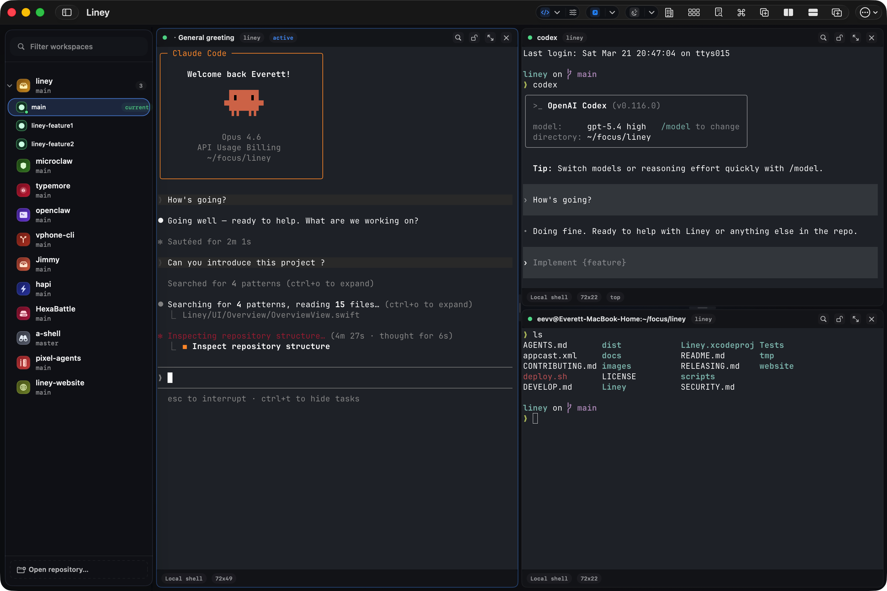

# Liney

[中文版本](./README.zh-CN.md)

[](https://liney.dev)
[](https://github.com/everettjf/liney/releases)
[](https://liney.dev)
[](./LICENSE)

Liney is a native macOS terminal workspace app for developers who work across repositories, worktrees, branches, and split panes.

It gives you one focused place to open codebases, switch worktrees, keep terminal layouts around, and move faster without juggling a pile of Terminal windows.



## Why Use Liney

- Keep multiple repositories and worktrees in one sidebar.
- Reopen the same pane layout when you come back to a repo.
- Mix local shell, SSH, and agent-backed terminal sessions.
- Stay in a native macOS app built around keyboard-heavy workflows.

## Install

### Homebrew

```bash
brew update && brew install --cask everettjf/tap/liney
```

### Direct Download

Download the latest signed `.dmg` from GitHub Releases:

<https://github.com/everettjf/liney/releases/latest>

## Quick Start

1. Open Liney.
2. Add one or more local repositories to the sidebar.
3. Select a repository or worktree and open a terminal tab.
4. Split panes as needed and switch worktrees without rebuilding your layout from scratch.

## Requirements

- macOS 15.6 or later
- Apple Silicon Mac

## Links

- Website: <https://liney.dev>
- Releases: <https://github.com/everettjf/liney/releases>
- Issues: <https://github.com/everettjf/liney/issues>
- Discord: <https://discord.com/invite/eGzEaP6TzR>

## For Developers

Development setup, build commands, testing, repo layout, and release docs live in [`DEVELOP.md`](./DEVELOP.md).

## License

Released under the Apache License 2.0. See [`LICENSE`](./LICENSE).
